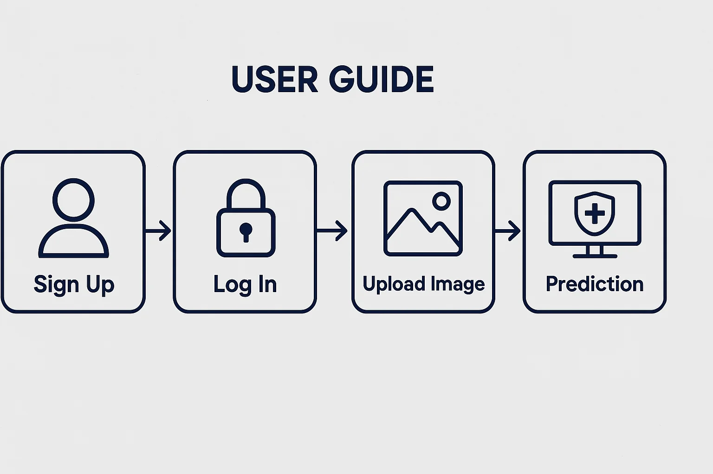

# skin_lesions
Artificial intelligence has the potential to revolutionize the way humans solves problem, and I personally thinks this will be possible in a near future and this is the reasoon, I am working on this project.
The project is not yet complete and open to new ideas.

# Skin Lesion Detection System

A modern AI-powered web application for **skin lesion analysis and skin cancer risk prediction**.  
Being built to assist clinicians and researchers with fast, accessible, and reliable image-based diagnostics predictions

---

## Features

- **AI-Powered Analysis**  
  Utilizes convolutional neural networks (CNN) for accurate prediction and segmentation of skin lesions (melanoma, benign, etc.).

- **Web-Based User Interface**  
  Clean dashboard for uploading images, visualizing results, and managing predictions.

- **Secure & Role-Based Access**  
  User authentication with JWT. Support for admin and regular user roles.

- **Modular & Scalable Architecture**  
  Separated frontend and backend for flexibility and easy scaling.

---

## Tech Stack

- **Backend:** Python, Flask, TensorFlow/Keras, SQLite  
- **Frontend:** HTML, CSS, JavaScript (Vanilla)  
- **Model:** Custom CNN for image classification & segmentation  
- **Authentication:** JWT (JSON Web Tokens)

---

## Project Structure


---

## Quick Start

1. **Clone the repository:**
   ```bash
   git clone https://github.com/your-username/skin-lesion-ai.git
   cd skin-lesion-ai
    ```
2. **Create a Python virtual environment & install dependencies:**
```bash
python -m venv venv
source venv/bin/activate
pip install -r requirements.txt
```
3. **Clone the repository:**
```bash
cd backend
python app.py

```


