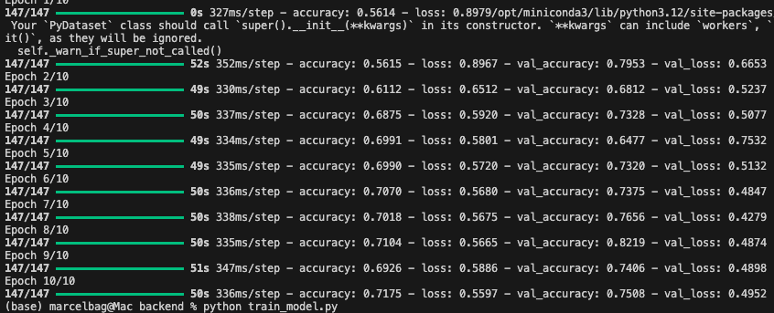

# skin_lesions
Artificial intelligence has the potential to revolutionize the way humans solves problem, and I personally thinks this will be possible in a near future and this is the reasoon, I am working on this project.
The project is not yet complete and open to new ideas.

# Skin Lesion Detection System

A modern AI-powered web application for **skin lesion analysis and skin cancer risk prediction**.  
Being built to assist clinicians and researchers with fast, accessible, and reliable image-based diagnostics predictions

---
[text](Users/marcelbag/Documents/projects/skin_lesions/backend/models/skin_lesion_model.keras)


## Features

- **AI-Powered Analysis**  
  Utilizes convolutional neural networks (CNN) for accurate prediction and segmentation of skin lesions (melanoma, benign, etc.).

- **Web-Based User Interface**  
  Clean dashboard for uploading images, visualizing results, and managing predictions.

- **Secure Authentication**  
JWT-based login, registration, and user management (Node.js/Express + MongoDB)
Admin dashboard for user management

- **Modular & Scalable Architecture**  
  Separation of backend (Flask for ML, Express for Auth/API), and frontend (HTML, CSS, JS)

  Easy to extend, improve, or deploy
---

## Tech Stack

- **Backend:** Python, Flask, TensorFlow/Keras, SQLite  
- **Frontend:** HTML, CSS, JavaScript (Vanilla)  
- **Model:** Custom CNN for image classification & segmentation  
- **Authentication:** JWT (JSON Web Tokens)

---

## Project Structure
```bash
skin_lesions/
│
├── backend/
│   ├── data_segmentation/
│   │   ├── images/
│   │   │   └── class1/
│   │   └── masks/
│   │       └── class1/
│   ├── models/
│   │   ├── model.py
│   │   ├── segmentation_model.py
│   │   ├── skin_lesion_model.h5
│   │   ├── skin_lesion_model.keras
│   │   ├── skin_classifier.keras
│   │   ├── train_segmentation_finetune.py
│   │   └── user.js
│   ├── flask_api.py
│   ├── server.js
│   ├── train_classifier_finetune.py
│   ├── train_model.py
│   ├── train_segmentation.py
│   ├── yolov5su.pt
│   └── uploads/
│
├── drawio/
│   ├── AI Circle.drawio
│   ├── Mini-batch.drawio
│   ├── Unbenanntes Diagramm.drawio
│   ├── Dataset_diagram.drawio.png
│   ├── OVERFITTING GRAPH
│   ├── Unsupervised_learning.drawio
│   ├── Machine learning_Regression.drawio
│   ├── Reinforce_learning.drawio
│   ├── Mathematical model of the formal neuron
│   └── ReLu graph.drawio
│
├── frontend/
│   ├── assets/
│   ├── cs/
│   │   └── styles.css
│   ├── js/
│   │   ├── app.js
│   │   ├── dashboard.js
│   │   ├── report.js
│   │   ├── script.js
│   │   └── upload.js
│   ├── about.html
│   ├── admin.html
│   ├── contact.html
│   ├── home.html
│   ├── index.html
│   ├── signin.html
│   └── signup.html
│
├── node_modules/
│
├── uploads/
│
├── venv/
│
├── README.md
├── LICENSE
├── requirements.txt
├── package.json
├── package-lock.json
├── image.png
├── image-1.png

```
---

## Quick Start

1. **Clone the repository:**
   ```bash
   git clone https://github.com/MarcelBag//skin_lesions.git
   cd skin-lesion-ai
    ```
2. **Create a Python virtual environment & install dependencies:**
```bash
python -m venv venv
source venv/bin/activate
pip install -r requirements.txt
```
3. **Start the nodejs server:**
```bash
cd backend
node backend/server.js

```
3. **train the segmentation model**
```bash
cd backend
python train_segmentation.py
```

4. **Start the backend server:**

```bash
cd backend
python flask_api.py
``` 


## 🚀 Open the Web App

Visit: [http://localhost:5000](http://localhost:5000)

### Key files

``` backend/flask_api.py ``` [Python] Flask API for ML predictions

```backend/server.js ``` [Node.js] Auth, user mgmt, image proxying to Flask

```backend/models/model.py ``` Prediction/classification pipeline

```backend/models/segmentation_model.py```U-Net segmentation


### How it works
- **Frontend (React or vanilla HTML/JS)** lets user upload image.

- **Express backend** receives, stores image, forwards to Flask for ML prediction.

- **Flask API** validates/crops image, runs segmentation + classification, returns result.

- **Results shown in web UI (malignant/benign/confidence)**.

---

## 🧠 Model Details

**CNN Architecture:**  
Fine-tuned convolutional neural network trained on skin lesion datasets ([ISIC](https://challenge.isic-archive.com/), etc.), with additional segmentation for lesion boundaries.

**Mathematical Foundation:**  
- Uses supervised deep learning  
- Data augmentation  
- Adam optimizer  
- Categorical cross-entropy loss  
- Early stopping for best generalization

---

## 📚 References

- [Marcel Shabani, “Predicting Skin Cancer Using Artificial Intelligence”, Master Thesis] (https://afya.tuunganes.com/)  
- [ISIC 2019: Skin Lesion Analysis Towards Melanoma Detection](https://challenge.isic-archive.com/)  
- [TensorFlow documentation](https://www.tensorflow.org/)  
- [Keras documentation](https://keras.io/)

---

## 🤝 Contributions

**Contributions are welcome!**  
Please open issues or pull requests for bug reports, improvements, or new features.

## Login Images




